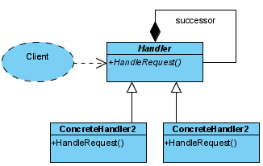

# Chain Of Responsibility #
Avoid coupling the sender of a request to its receiver by giving more than one
object a chance to handle the request. Chain the receivingobjects and pass the
request along the chain until an objecthandles it.

### Solution ### 

* **Handler:** defines an interface for handling requests and implements the successor link.
* **ConcreteHandler:** handles requests it is responsible for, can access its successor and if the ConcreteHandler can handle the request, it does so; otherwise
  it forwards the request to its successor.