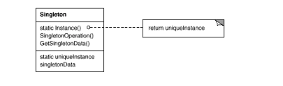

# Singleton #
A singleton is a class that allows only a single instance of itself to be created and gives access to that created instance. 
It contains **static variables that can accommodate unique and private instances of itself**. 
It is used in scenarios when a user wants to restrict instantiation of a class to only one object. 
This is helpful usually when a **single object** is required to coordinate actions across a system.
A singleton is intended to provide only one instance of itself while facilitating a global point of access. 
Implementing a singleton pattern involves creating a class with a method that creates a new instance of the class. 
In order to implement a singleton pattern, principles of single instance and global access must be satisfied. 
The singleton class is like a global repository for an instance of itself, making the constructor private.
Another version of Singleton is thread safe that allow you To make a singleton class thread-safe, 
**getInstance() method is made synchronized so that multiple threads can’t access it simultaneously.**

