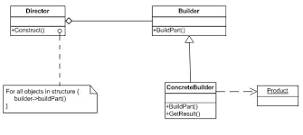

# Builder Pattern #
Builder is a creational design pattern that lets you construct complex objects step by step. The pattern allows you to 
produce different types and representations of an object using the same construction code.
The builder patter suggests you to extract object construction and move it to another class called Builder.
A version of builder is inside a spring boot library called Lombok that permits you through class annotation
@Builder to implements the pattern.

