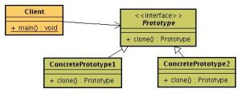

# Prototype Pattern #
Prototype is a creational design pattern that lets you copy existing objects without making your code dependent on their classes.
The Prototype pattern delegates the cloning process to the actual objects that are being cloned. The pattern declares a 
common interface for all objects that support cloning. 
This interface lets you clone an object without coupling your code to the class of that object. 
Usually, such an interface contains just a single clone method.
The implementation of the clone method is very similar in all classes. 
The method creates an object of the current class and carries over all of the field values of the old object into the new one. 
You can even copy private fields because most programming languages let objects access private fields of other objects 
that belong to the same class.
An object that supports cloning is called a prototype. 
When your objects have dozens of fields and hundreds of possible configurations, 
cloning them might serve as an alternative to subclassing.

