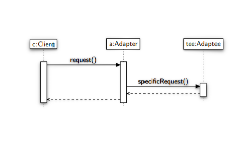

### Intent ###
Convert the interface of a class into another interface clients expect. Adapter
lets classes work together that couldn't otherwise because of incompatible
interfaces

### Solution ###
**Target:** Is the interface that the client expects.

**Adaptee:** Is the library object.

**Adapter:** Is the concrete object used by client that adapt the request.

### Sequence Diagram ###

### UML ###
