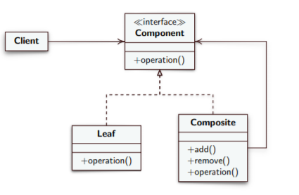

# Composite #
### Intent ###
Compose objects into tree structures to represent part-whole hierarchies.
Composite lets clients treat individual objects and compositions of objects
uniformly.

### Motivation ###

* It is necessary to group simple elements together to form larger elements
* Composite allows you to describe a recursive composition, that permits the client to treat all elements evenly.

### Solution ###

* **Component:** Interface (or abstract class) that rappresents simple elements and not.
Implements common operation and can define an operation that allows elements to access parent
  object in the recursive structure;
  
* **Leaf:** Subclass of Component that rappresents the simple element;

* **Composite:** Container class that defines the behavior for the aggregate of child elements;
holds the reference to each of the child elements.

