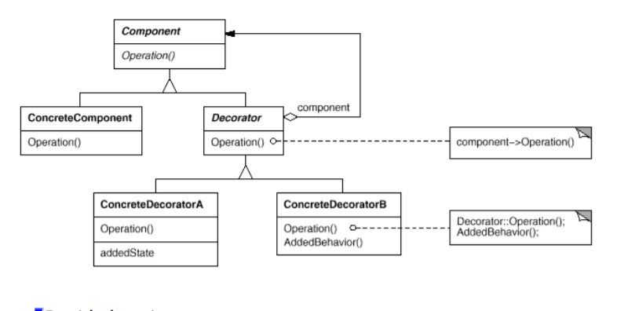

# Decorator #
Attach additional responsibilities to an object dynamically. Decorators provide
a flexible alternative to subclassing for extending functionality.

### Motivation ###
* Sometimes you want to add responsibilites to individual objects.
To add responsibility you could make use of inheritance, however, there would be no flexibility.
  Client can't control how and when to decorate a component.
  
* We want an approch flexible to wrap a component into another component that add a responsibility.
* We can subtract a responsibility dinamically.

### Solution ###

* **Component:** defines the interface for objects that can have responsibilities
  added to them dynamically

* **ConcreteComponent:** defines an object to which additional responsibilities can be
  attached
  
* **Decorator:** maintains a reference to a Component object and defines an interface
  that conforms to Component's interface. 

* **ConcreteDecorator:** adds responsibilities to the component. 