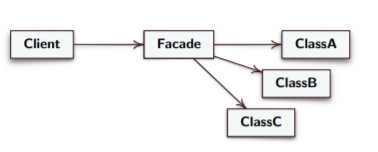

# Facade #

### Intent ###
Provide a unified interface to a set of interfaces in a subsystem. Facade defines
a higher-level interface that makes the subsystem easier to use. 

### Motivation ###
* Sometimes we have a lot of correlated class that work together to implements a complex system;
* We would reduce communication between client and subsystem;

### Solution ###

* **Facade:** knows which subsystem classes are responsible for a request and delegates client requests to appropriate subsystem objects
* **Client:** Object that call facade;