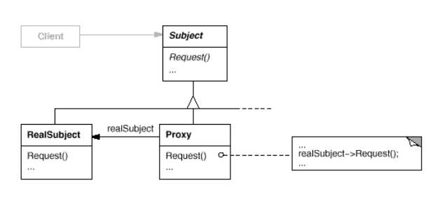

# Proxy pattern #
### Intent ###
Provide a surrogate or placeholder for another object to control access to it. 

### Motivation ###

* Controlling access to an object and defer the full cost of its creation and initialization until we need to use it;
* Create object on demand, only we need to use it;

### Solution ###

* **Proxy:** 
  * maintains a reference that lets the proxy access the real subject.
  Proxy may refer to a Subject if the RealSubject and Subject interfaces
  are the same.
  * provides an interface identical to Subject's so that a proxy can
    by substituted for the real subject.
  * controls access to the real subject and may be responsible for
    creating and deleting it.
    
* **Subject:** defines the common interface for RealSubject and Proxy so that a
  Proxy can be used anywhere a RealSubject is expected.

* **RealSubject:** defines the real object that the proxy represents.

